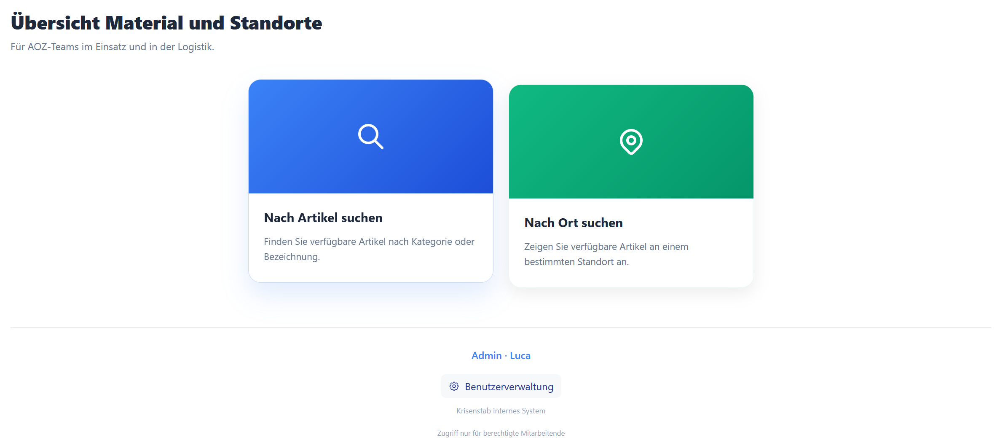
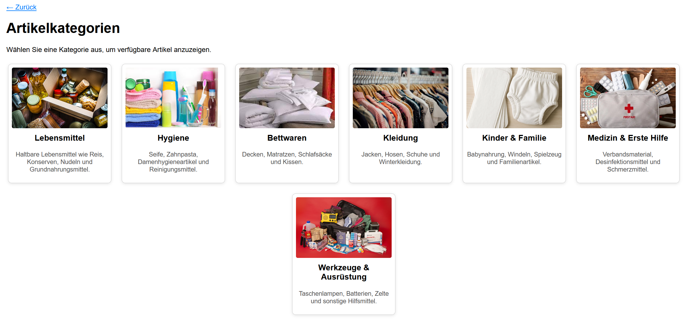
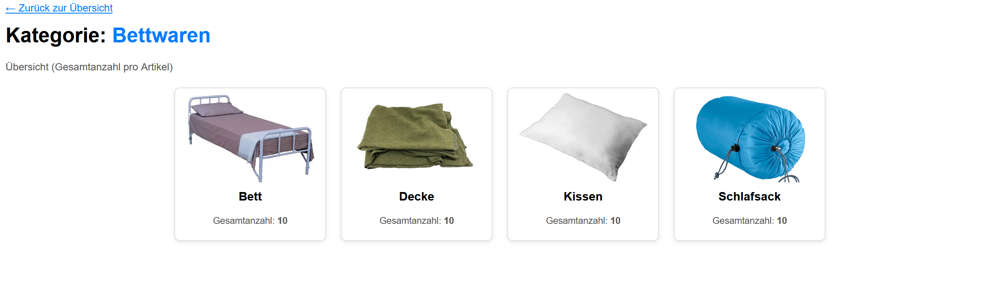
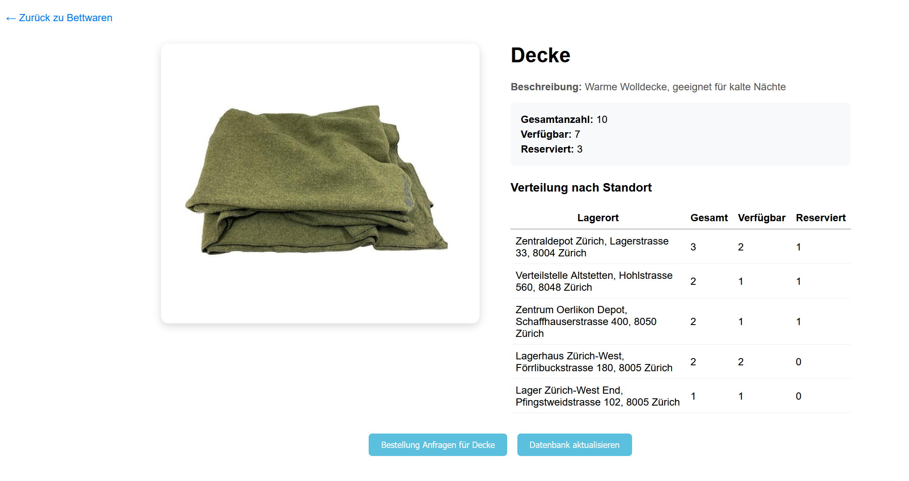
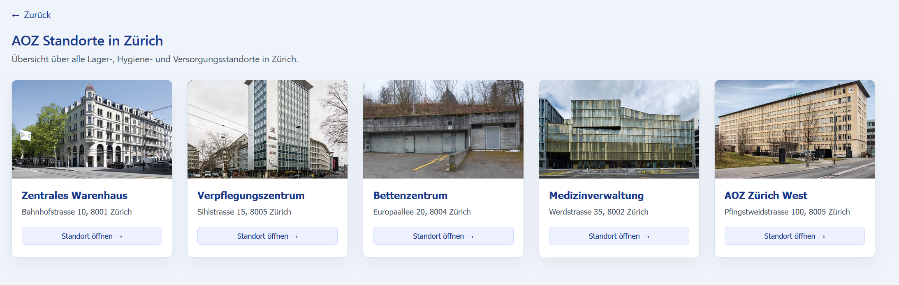
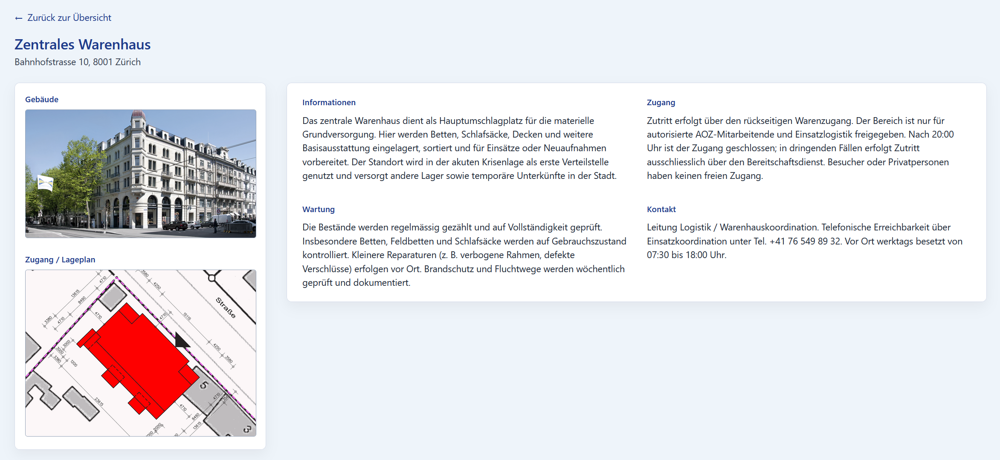
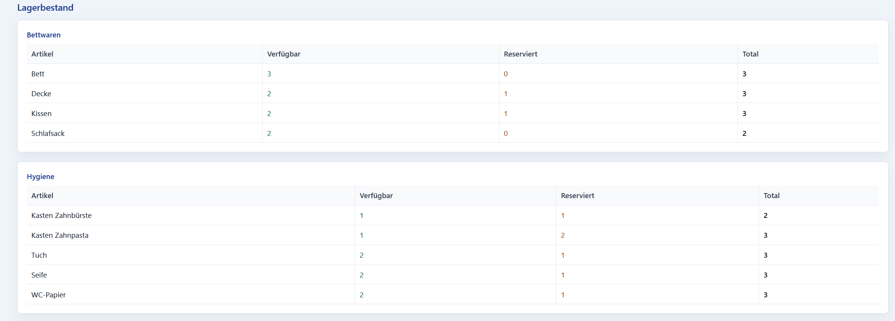
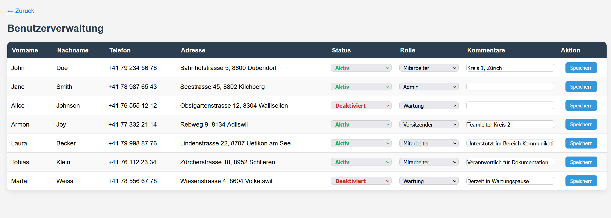
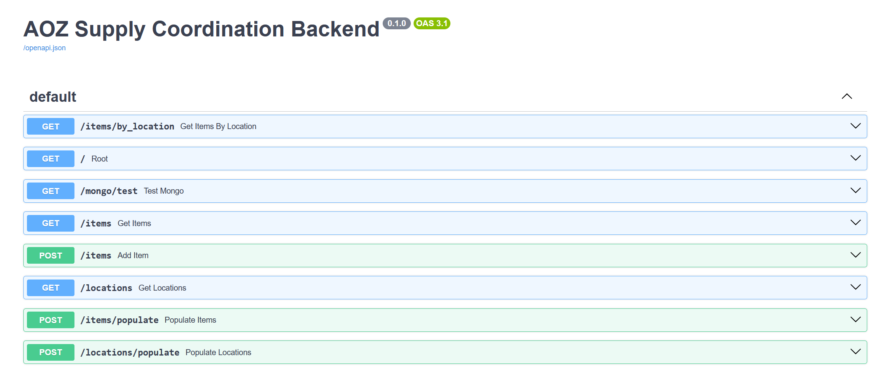

# CrisisCore - Crisis Supply Coordination Platform

## 1. Title of the Project
**CrisisCore - Crisis Supply Coordination Platform**

A digital platform to coordinate emergency supply procurement, storage, and distribution for AOZ (Asylorganisation Zürich) and related city departments during crisis situations.

---

## 2. Team Members
- **Nikola Petrovic**
- **Daniel Toth**
- **Luca Zanetti**

---

## 3. Description of the Challenge
During migration or humanitarian crises, AOZ must rapidly coordinate the procurement and management of essential goods such as beds, blankets, hygiene items, and furniture.  
Currently, different departments (e.g., Zivilschutz, Sozialdepartement, Tiefbauamt) handle these supplies separately, leading to duplication, inefficient storage, and limited transparency.

The challenge is to design a **centralized digital system** that improves coordination, enables joint procurement, monitors stock and availability in real time, and ensures faster response and resource allocation during emergencies.

---

## 4. Solution Overview
** WORK IN PROGRESS **
*(To be completed after development — include screenshots, workflow, and demo link here)*

CrisisCore is designed with different use cases in mind. In crisis management, an intuitive UI and well thought through workflows are key. The following main user flows were identified:
- A member of the crisis management team ("Kriesenstab" in German) requires some amout of a certain resource (for example beds or towels)
- A member of the maintanance team wants to look up the stocks at a certain location
- A crisis management team lead requires to fastely handle access permissions to the platform

The above workflows resulted in the different UI's explained further below.

### 4.1 General overview
After sign in the following page is displayed with the 3 different options available:


To search for specific resources the blue botton ("Nach Artikel suchen") can be used. For locations the green button to the right can be used and for managign users there is a button at the bottom of the page called "Benutzerverwaltung".

### 4.2 Items and Resources workflow
This workflow allows to search for specific items or resources which are required independent of their current storage location. For example a member of the crisis management team might be searching for blankets and would take the following path:

1. Select the correct category the item falls into (for example bedding)


2. Select the exact item required (blankets)


3. An overview of the current amounts of the item are displayed as well as how many are where in use or free and can be used. 


### 4.3 Per Location stock workflow
This workflow is especially usefull if the items available at a certain location shall be accessed (for example for maintenance tasks). As an example a member of the maintencanse team wants to check the resources in place `abcd example place`.

1. Select the correct place to inspect


2. A overview of data related to the location itself is displayed including:
- Building plan of the location as well as picture of the building/entrance
- Description of the access to the location
- Table with all items currently present at this location



### 4.4 User Management
The user management view is only accessible for user with the administrator role or crisis management team lead. It shall allow to activate/deactivate the access to the platform for any user as well as define the role and thus also the access a certain user shall have.


### 4.5 Link to Demo Video
TBD

### 4.6 Running the application locally
***Perequisits***
- Python version 3.11 installed
- Node v20.8.1
- npm v10.5.1
- docker 
- docker compose

***Backend***

In order to run the backend, navigate into the `backend` folder and use the following command to install all required dependencies:
```bash
pip install --no-cache-dir -r requirements.txt
```

Build the containerized environent:
```bash
docker compose up -d
```

Run development server:
```bash
cd backend
cd app
uvicorn main:app --reload
```

Verify that the backend is running successfully:
- Check the Swagger UI page, describing the endpoints of the backend: http://127.0.0.1:8000/docs


- Check DB UI page: http://localhost:8081/ should ask for a username and password when accessed


***Frontend***
For the frontend install all dependencies using:
```
cd frontend
npm install
```

Run the application using the following command:
```
npm start
```

---

## 5. Tech Stack
| Component | Technology |
|------------|-------------|
| **Frontend** | React (TypeScript) |
| **Backend** | FastAPI (Python) |
| **Database** | MongoDB (primary), PostgreSQL (optional for structured data) |
| **Containerization** | Docker & Docker Compose |
| **Tools & Utilities** | Mongo Express, Adminer, Node.js, npm |

---

## 6. Responsibilities
The following table shall give an overview of the different responsibilities each team member had.
The initial planning phase consisting of User Stories and taking decisions in the design process was performed by all team mebers in collaboration.

### 6.1 Solution Implementation

| Task | Responsible team member |
|------------|-------------|
| Docker setup | Luca |
| Backend - Items endpoints | Daniel |
| Backend - Locations endpoints | Daniel |
| Backend - Users endpoints | Luca |
| Frontend - LogIn Page & Initial view | Nikola |
| Frontend - Item Pages & navigation | Daniel |
| Frontend - Locations Page | Nikola |
| Frontend - User Management Page | Luca |
| Frontend - General styling | Nikola |


### 6.2 Report
While all members reviewed and edied the different sections, the following table gives an overview over which member took the lead and did most of the work for the corresponding section.
| Task | Responsible team member |
|------------|-------------|
| Problem and Motivation | Luca |
| Solution design & fit to the GaaP concept | Nikola |
| Approach | Daniel |
| Collected Data | Daniel |
| Analysis | Nikola |
| Reflections | Luca |
| Conclusions | Luca |
| References | All |
| Appendix | All |
| GitHub ReadMe | Luca|
